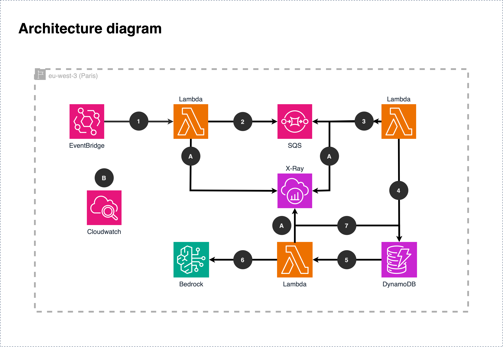

# Journal Officiel 🇫🇷

Project aiming to provide a better understanding of legal publications of French "Journal Officiel" published every week day.

## Architecture

### Functional workflow
- **1** - An EventBridge schedule invoke a Lambda, with the current date as payload. Lambda use the date to get the summary of all the changes published for the day given in the payload.
- **2** - For each change, the Lambda will publish his ID and URL in the SQS queue.
- **3** - The Lambda will get the ID and URL in the queue, get the content of the change.
- **4** - The Lambda will persist the data in the DynamoDB table.
- **5** - The DynamoDB table will invoke a Lambda to create the summary of the change persisted.
- **6** - The Lambda compute the summary with Bedrock.
- **7** - The Lambda persist the summary in the DynamoDB table.

### Technical workflow

- **A** - Lambda publish technical performance data in the Application Performance Manager "X-Ray".
- **B** - Systems are monitored using Cloudwatch (dashboards, logs, etc.).